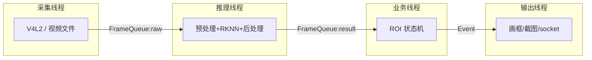
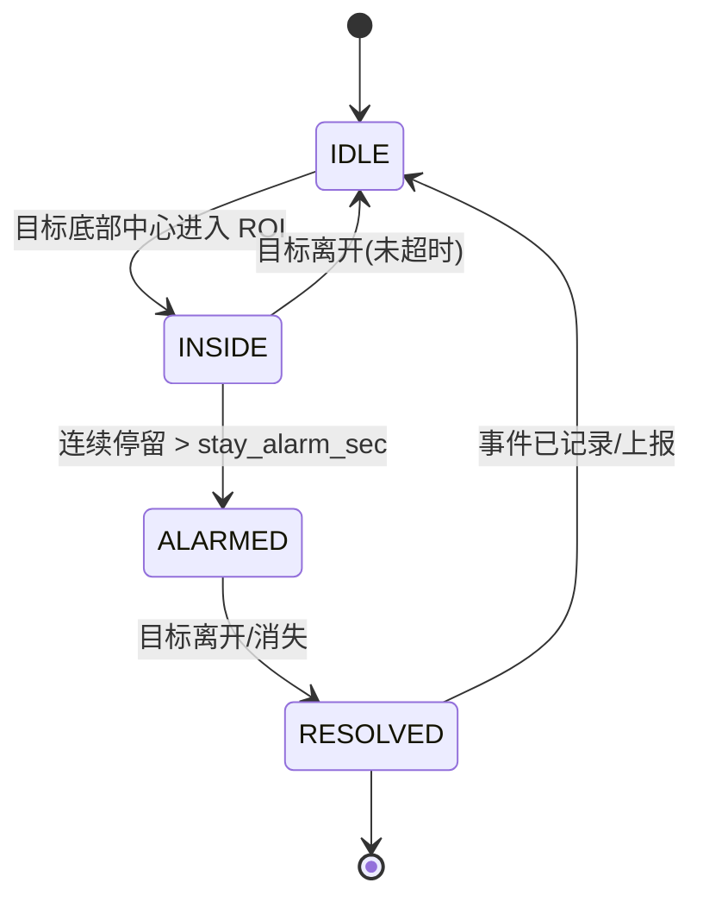

# 架构设计文档

> 本文件是"D3 读官方 demo"和后续写代码时的对照基准：先讲清设计，再按图填充实现。

## 1. 系统调用链（总览）

```
V4L2 采集(OV13850/文件)
   ↓  Frame(raw: NV12/BGR)
预处理: 缩放/格式转换到 NPU 输入(640x640 int8/fp16)  ← 可用 RGA 硬件
   ↓
RKNN 推理(YOLOv5s, RKNN C API)
   ↓  outputs(3 个尺度的原始 tensor)
后处理: 解码 bbox/conf + NMS + 类别过滤(白名单)
   ↓  DetObject 列表(带时间戳)
业务层: ROI 区域判定 + 事件状态机
   ↓  事件(进入/滞留告警/离开)
输出: 画面叠加 + 告警截图 + 本地事件日志 + socket 上报(JSON)
```

### RKNN C API 主流程（对应官方 C demo 里的四处调用）
```
rknn_init(ctx, model_path, ...)         // 加载 .rknn
rknn_query(ctx, RKNN_QUERY_IN_OUT_NUM)  // 查输入/输出个数与尺寸
循环:
  rknn_inputs_set(ctx, inputs)          // 喂预处理后的图
  rknn_run(ctx)                         // 跑 NPU
  rknn_outputs_get(ctx, outputs)        // 取结果
  rknn_outputs_release(...)
```

## 2. 线程模型

| 线程 | 职责 | 与上/下游通信 |
|---|---|---|
| Capture 线程 | V4L2 采集/文件读帧，时间戳 | push raw 帧到 `raw_queue` |
| Infer 线程 | 预处理 + RKNN 推理 + 后处理 | 从 raw_queue pop；push `result` 到 `result_queue` |
| Business 线程 | ROI 判定 + 事件状态机 | 从 result_queue pop；产出 `Event` |
| Output 线程 | 画框/截图/日志/socket 上报 | 消费 Event + 最新帧 |



关键点：
- 每级之间用**有界队列**解耦，采集快/推理慢不会互相阻塞整条链；
- 队列满时**丢最旧帧**（保实时性优先于保完整性）；
- 帧数据用 `shared_ptr` 流转，避免深拷贝；
- 这套生产者-消费者模型可直接复用用户态路由器项目里的线程池设计。

## 3. 核心数据结构

```
Frame      { w, h, fmt(NV12/BGR/RGB), pts_us, data }
DetObject  { cls_id, conf, x1,y1,x2,y2, bottom_center(x, y) }
Event      { type: INTRUDE/ALARM/LEAVE/RESOLVE, cls_id,
             ts_start, stay_ms, snapshot_path }
```

判定用**检测框底部中心点**是否落在 ROI 内（人站在区域内才叫入侵，框顶部越过不算）。

## 4. 事件状态机（business 层核心）



简化约定（第一版）：
- 不引入 ByteTrack 级别的多目标跟踪；
- 用"ROI 内是否存在关注类别的检出框"做**帧级判定**，用连续帧计时近似"同一目标停留时长"；
- 计时中断（离开 ROI / 连续丢帧超过阈值）即重置。
- 局限（第一版接受的简化）：多人同时进出会近似合并；后续可用中心点 IoU 简易关联升级为多目标。

## 5. 模块接口（代码骨架中的 .hpp）

| 文件 | 职责 | 关键接口 |
|---|---|---|
| `src/common/frame.hpp` | 帧结构 + 线程安全有界队列 | `FrameQueue::push/pop` |
| `src/common/config.hpp` | 读 intruder.conf | `Config::get<int>/get<string>` |
| `src/capture/v4l2_camera.hpp` | V4L2 采集 | `open/start/get_frame/stop` |
| `src/infer/rknn_engine.hpp` | RKNN 推理封装 | `init/infer` |
| `src/business/roi_monitor.hpp` | ROI+状态机 | `feed(det,now)->EventList` |
| `src/output/reporter.hpp` | 截图+socket 上报 | `on_event/connect` |

## 6. 明确不做
- 模型训练/微调；复杂多目标跟踪；Web/云后端；内核/驱动改动。
